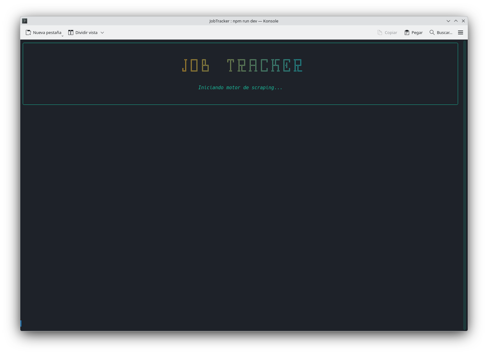
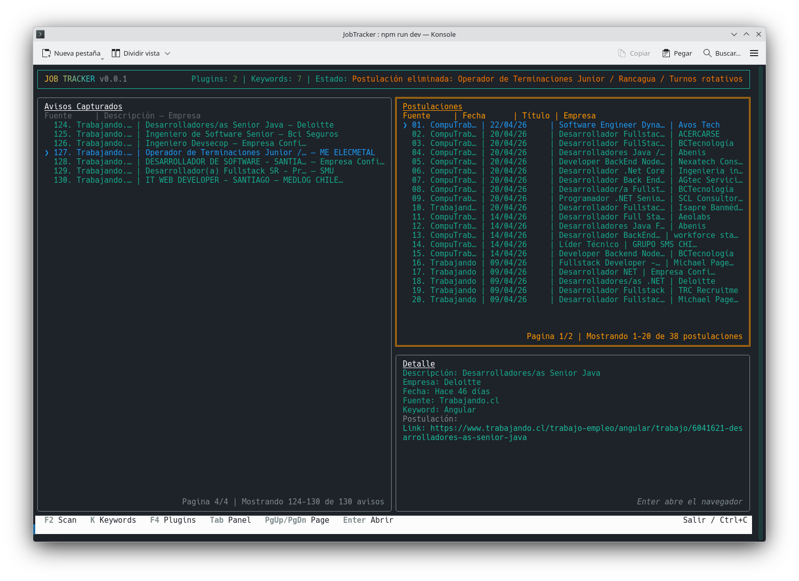
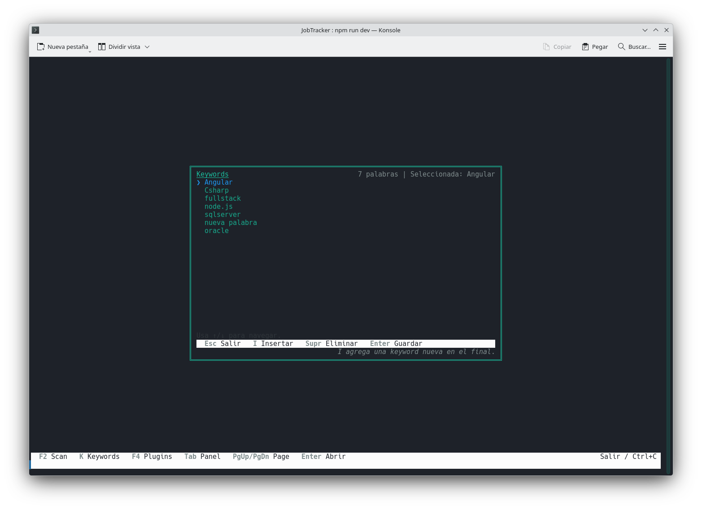

# JobTracker 🚀

<p align="center">
  <a href="./README.md">Español</a> ·
  <a href="./README.en.md"><strong>English</strong></a>
</p>

<p align="center">
  
  
  
  
</p>

**JobTracker** is a job search and tracking TUI designed to centralize listings, keywords, and applications in one fast terminal interface.

## Main Screen

```
┌─────────────────────────────────────────────────────────────┐
│  🔍 JobTracker v0.0.2    [Plugins: 1] [Keywords: 3]          │
│  Status: Welcome! No previous data.                         │
├────────────────────────────┬────────────────────────────────┤
│  📋 Job Listings           │  📬 Applications               │
│  ──────────────────────    │  ──────────────────            │
│  1. Senior Developer...   │  1. Backend Dev - TechCorp     │
│     Bumeran | 2d ago      │     LinkedIn | 04/15/2026       │
│  2. Node.js Engineer...   │  2. Full Stack - StartupX       │
│     Computrabajo | 3d ago │     Indeed | 04/10/2026          │
├────────────────────────────┴────────────────────────────────┤
│  📝 Detail: Senior Developer @ TechCorp                    │
│     Keywords: [nodejs] [backend] [remote]                  │
│     📅 04/20/2026 | 🔗 https://...                          │
├─────────────────────────────────────────────────────────────┤
│  [S] Scan  [K] Keywords  [P] Plugins  [Tab] Panel  [Q]  │
└─────────────────────────────────────────────────────────────┘
```

## Hotkeys

### Navigation
| Key | Action |
|-----|--------|
| `↑` / `↓` | Navigate between records in active panel |
| `Tab` | Switch between panels (Jobs → Applications → Detail) |
| `PageUp` / `PageDown` | Paginate in active panel |

### Quick Actions
| Key | Panel | Action |
|-----|-------|--------|
| `Enter` | Jobs | Copy job to applications |
| `Enter` | Applications | Open application detail |
| `Enter` | Detail | Open job link in browser |
| `Supr` | Detail Modal | Delete selected application |

### Global Functions
| Key | Action |
|-----|--------|
| `S` | Start scan with plugins |
| `K` | Open keywords modal |
| `P` | Open plugins panel |
| `Q` | Exit application |

### Keywords Modal (K)
| Key | Action |
|-----|--------|
| `I` | Insert new keyword |
| `Enter` | Save keyword (in insert mode) |
| `Supr` / `Del` | Delete selected keyword |
| `Esc` | Close modal |

### Plugins Modal (P)
| Key | Action |
|-----|--------|
| `A` | Add plugin (enter .scrapper path) |
| `E` | Delete selected plugin |
| `Enter` | Install plugin (in install mode) |
| `Esc` | Close modal |

## CLI Options

### npm Scripts

```bash
# Development - Full TUI
npm run dev

# Auto-scan on start
npm run dev:find

# Add keyword without entering TUI
npm run dev:add -- "nodejs"

# Delete keyword without entering TUI
npm run dev:del -- "nodejs"

# Silent mode (no TUI)
npm run dev:silent

# Print stored jobs
npm run print:jobs

# Plugin management
npm run dev:plugin          # Open TUI with dev plugins mode
npm run dev:plugin:find     # Plugin + auto-scan
npm run dev:install-plugin  # Install plugin by path
```

### Direct Flags

```bash
# Scan on start
npx tsx src/infrastructure/adapters/cli/app.tsx --find

# Without splash screen
npx tsx src/infrastructure/adapters/cli/app.tsx --noSplash

# Add keyword
npx tsx src/infrastructure/adapters/cli/app.tsx --addKey "backend"

# Delete keyword
npx tsx src/infrastructure/adapters/cli/app.tsx --delKey "backend"

# Install plugin
npx tsx src/infrastructure/adapters/cli/app.tsx --addPlugin "/path/to/plugin.scrapper"

# Full help
npx tsx src/infrastructure/adapters/cli/app.tsx --help
```

## Screenshots

### 1. Splash
Startup screen showing version and loading status.



### 2. Main Layout
View of the layout with three panels and shortcuts footer.



### 3. Detail Dialog
Centered modal to add or delete keywords.



## Technical Stack

- **Language**: TypeScript

For detailed architecture, patterns, and technical specifications, see the [SPEC.md](./Spec.en.md) (also available in [Spanish](./SPEC.md)).

## Installation

```bash
npm install
npm run dev
```

## Contributing

1. Fork the repository
2. Create a branch (`git checkout -b feature/my-change`)
3. Commit your changes
4. Push your branch
5. Open a Pull Request

## Contact

<p align="center">
  <a href="https://www.linkedin.com/in/sepulvedamarcos">
    
  </a>
  <a href="mailto:sepulvedamarcos@gmail.com">
    
  </a>
  <a href="https://ko-fi.com/sepulvedamarcos">
    
  </a>
</p>

---

Built for people who prefer to automate their job search without giving up control of their data.